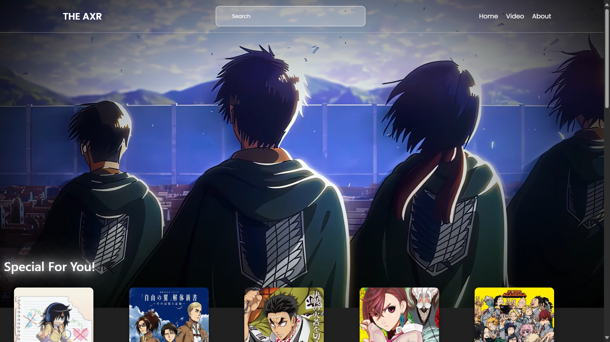

# 🌸 AnimeExplainer — Built with HTML, CSS & JavaScript

Welcome to **AnimeExplainer** — a lightweight, fast web app built using plain **HTML, CSS, and JavaScript**.  
This project powers the frontend of [animeexplainer.netlify.app](https://animeexplainer.netlify.app), a sleek and elegant platform for anime video explainers, reviews, and creative content.

---

---

## 🚀 Tech Stack

| Tech         | Description                                 |
|--------------|---------------------------------------------|
| 🧑‍💻 HTML     | Markup language for structuring web content |
| 🎨 CSS       | Stylesheet language for designing UI         |
| ⚙️ JavaScript | Programming language for interactive behavior |

---

## 📝 Project Focus

This project focuses on:  
- Anime-centered web experiences  
- Seamless video embedding & display  
- Responsive grid layouts and creative UI  
- Professional site footers with privacy, terms, and contact info  

Ideal for content creators, anime reviewers, or YouTubers building their own websites.

---

## 📂 Project Setup

To get started, simply open the `index.html` file in your preferred browser.  
No build steps or package managers are required.

---

## 💡 Note for Developers

For a production-ready app, consider:  
- Adding preprocessors like Sass for better CSS management  
- Using JavaScript modules or bundlers for larger projects  
- Adding accessibility and SEO best practices  
- Hosting on platforms like Netlify or GitHub Pages for easy deployment

---

Enjoy building with AnimeExplainer! 🌸
