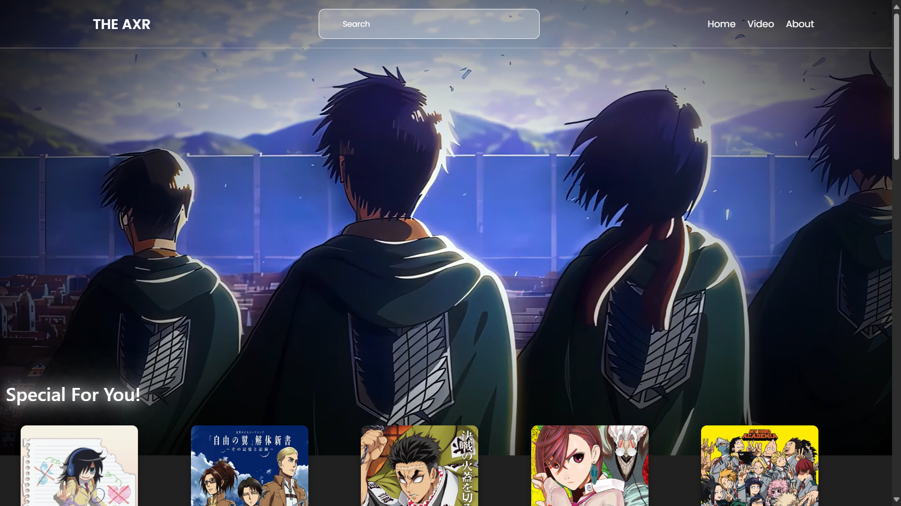

# 🌸 AnimeExplainer — Built with React + Vite

Welcome to **AnimeExplainer** — a lightweight, blazing-fast React web app built using **Vite**.  
This project powers the frontend of [animeexplainer.netlify.app](https://animeexplainer.netlify.app), a sleek and elegant platform for anime video explainers, reviews, and creative content.

[](https://app.netlify.com/projects/animeexplainer/deploys)
---



---

## 🚀 Tech Stack

| Tech | Description |
|------|-------------|
| ⚛️ React | UI Library for building user interfaces |
| ⚡ Vite | Next-gen frontend tool for lightning-fast development |
| 🎯 ESLint | Code linter for clean, consistent code |
| 🎨 CSS3 | Custom handcrafted styles for a polished look |
| 🧩 React Icons | Beautiful icons from social platforms & more |
| 🔄 Fast Refresh | Hot module replacement for rapid development |

---

## 🔧 Used Plugins

### Official Vite Plugins

- [`@vitejs/plugin-react`](https://github.com/vitejs/vite-plugin-react)
  - Uses **Babel** for JSX transformation and **Fast Refresh**.

You can optionally switch to:

- [`@vitejs/plugin-react-swc`](https://github.com/vitejs/vite-plugin-react/tree/main/packages/plugin-react-swc)
  - Uses **SWC** compiler for even faster refresh and modern JS support.

---

## 📝 Project Focus

This template is focused on:
- Anime-centered web experiences
- Seamless video embedding & display
- Responsive grid layouts and creative UI
- Professional site footers with privacy, terms, and contact info
- Optimized build performance using Vite

Ideal for content creators, anime reviewers, or YouTubers building their own websites.

---

## 💡 Note for Developers

If you're building a **production-ready** application, consider:
- Adding **TypeScript** for type safety
- Enabling **type-aware linting** via [`typescript-eslint`](https://typescript-eslint.io)
- Checking out the [TypeScript React template](https://github.com/vitejs/vite/tree/main/packages/create-vite/template-react-ts)

---

## 📂 Project Setup

```bash
# Install dependencies
npm install

# Start local dev server
npm run dev

# Build for production
npm run build
